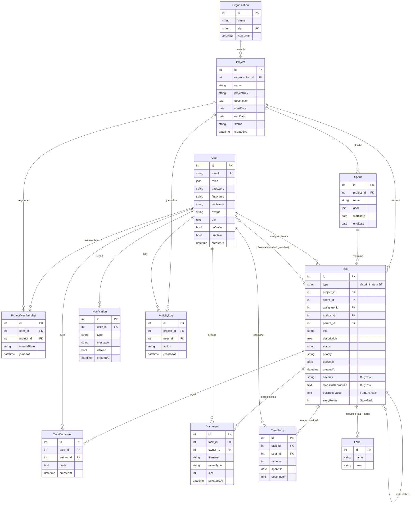
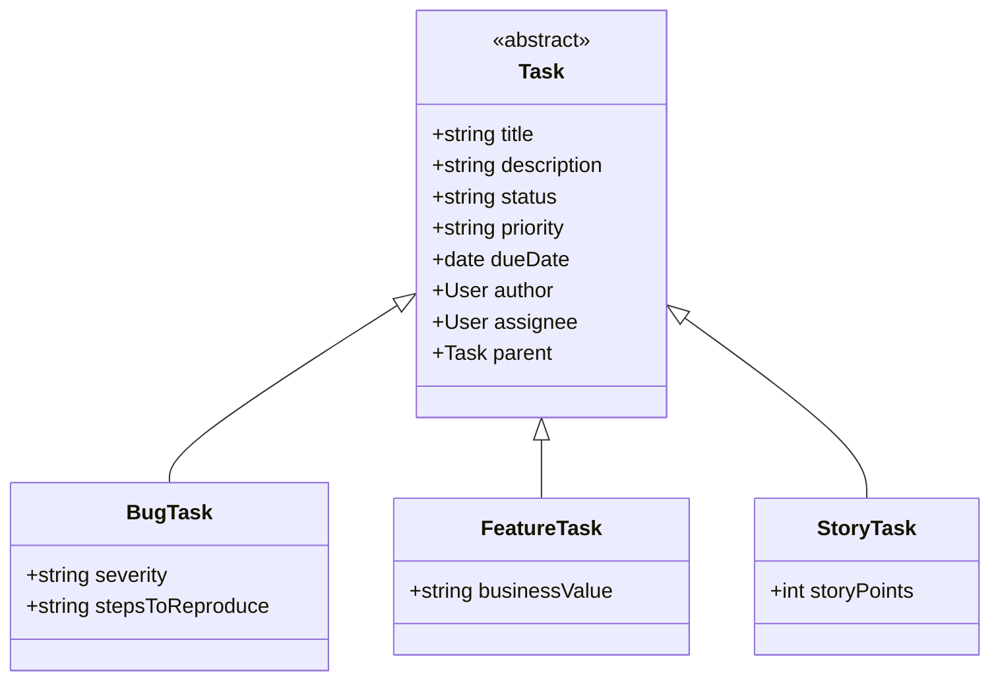

# Schéma de la base de données — TaskFlow

Modèle conceptuel de données (MCD) et diagramme de classes du domaine, tenu **à jour avec le
code** (`src/Entity/`) et les migrations Doctrine. Rendu nativement par GitHub (Mermaid).

**Entités : 15 classes** — 12 tables « simples » + `Task` (table unique, héritage STI) déclinée en
`BugTask` / `FeatureTask` / `StoryTask`. Tables physiques : 13 + 2 tables de jonction
(`task_label`, `task_watcher`).

## Diagramme entité-relation (MCD)



## Héritage — `Task` (Single Table Inheritance)

Une seule table `task`, colonne discriminante `type` (`bug` / `feature` / `story`). Les champs
spécifiques de chaque sous-type sont des colonnes nullables de cette table.



## Récapitulatif des relations (exigences du sujet)

**ManyToMany — 3 (exigence : ≥ 2)**
- `User ↔ Project` via l'entité de liaison **ProjectMembership** (avec attributs : rôle interne,
  `joinedAt`).
- `Task ↔ Label` (table de jonction `task_label`).
- `Task ↔ User` — **observateurs** d'une tâche (table de jonction `task_watcher`).

**OneToMany / ManyToOne — 14 (exigence : ≥ 8)**
`Organization→Project` · `Project→Sprint` · `Project→Task` · `Sprint→Task` ·
`Task→Task` (sous-tâches, auto-référence) · `Task→TaskComment` · `User→TaskComment` ·
`Task→Document` · `User→Document` · `Task→TimeEntry` · `User→TimeEntry` · `User→Notification` ·
`Project→ActivityLog` · `User→ActivityLog` · `User→Task` (assigné + auteur).

**Héritage** : `Task` (STI) → `BugTask`, `FeatureTask`, `StoryTask`.

---

> **Régénérer / vérifier le schéma réel** depuis la base :
> ```bash
> docker compose exec php php bin/console doctrine:schema:validate
> ```
> Pour un export image, coller les blocs Mermaid ci-dessus dans <https://mermaid.live> puis
> exporter en PNG/SVG.
